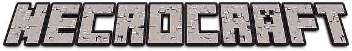

--- 

**NecroCraft** aims to be the most complete mystical necromancy mod for Minecraft (NeoForge), built around deep, total customization of your undead minions.

Raise the dead, bind them to your will with a **Soul Totem**, and shape each minion's behavior by carving in **Bonuses** at the **Soul Carving Table** — turning a simple undead servant into a dedicated miner, a relentless hunter, a self-sufficient farmer, or a quiet stockpiler that lives to fill your chests.

---

## Table of Contents

- [Features](#features)
- [Minions](#minions)
    - [Innate Traits](#innate-traits)
- [The Soul Totem](#the-soul-totem)
- [Bonuses](#bonuses)
    - [Bonus Types](#bonus-types)
    - [Slot Limits](#slot-limits)
    - [Available Bonuses](#available-bonuses)
- [The Soul Carving Table](#the-soul-carving-table)
- [Technical Overview](#technical-overview)

---

## Features

- 🧟 **Summon any classic undead mob** as a loyal minion — zombies, husks, drowned, skeletons, strays, bogged, and parched, each with their own base stats and a unique innate trait.
- 🔮 **A dedicated Soul Totem** that stores a minion's full loadout (equipment + bonuses) so you can re-summon the exact same minion configuration at any time.
- ⚒️ **A fully-fledged Bonus system** split into three categories — Passive, Profession, and Post-Mortem — letting you mix and match abilities to build the perfect minion for the job.
- 🪑 **The Soul Carving Table**, a dedicated crafting/editing station with its own inventory layout for equipping gear and installing bonuses onto a totem.
- 🏹 **Smart, gated AI behavior** — minions only run combat, farming, or planting logic when the right bonus (or lack of one) allows it, so a sedentary farmer minion won't wander off to fight.
- 📦 **Personal minion inventories** (27 slots) with automatic loot pickup, chest storage, and drop-on-death, so your minions are also mobile storage and looters.

---

## Minions

Every classic Minecraft undead mob can be summoned as a minion:

| Minion | Based on |
|---|---|
| Zombie Minion | Zombie |
| Husk Minion | Husk |
| Drowned Minion | Drowned |
| Skeleton Minion | Skeleton |
| Stray Minion | Stray |
| Bogged Minion | Bogged |
| Parched Minion | Parched |

All minions share the same core behavior:

- They belong to a **summoner** (an owner) and will follow, defend, and be defended by them.
- They carry their **own 27-slot inventory**, independent from any equipped gear.
- They can be given a **weapon/tool and armor**, exactly like a player.
- If left too far behind, they will **teleport back near their owner** automatically (unless sedentary).
- On death, they **drop their carried inventory** and trigger any **Post-Mortem bonus** they had equipped.
- Right-clicking a minion (empty hand, not sneaking) opens its **personal inventory**.

### Innate Traits

Beyond the shared behavior, each undead type comes with its own built-in trait — a small bonus baked into the mob itself, on top of anything the player equips through totems.

- **Drowned Minion** — grants itself **Curse of the Sea**, providing infinite underwater breathing and passive healing while submerged.
- *(Additional innate traits for other minion types are planned/expandable.)*

---

## The Soul Totem

The **Soul Totem** is the heart of minion customization. It's the item you summon your minion *from*, and it doubles as a save file for that minion's build:

- Stores the minion's **equipped gear** (helmet, chestplate, leggings, boots, main hand, off hand).
- Stores the minion's **equipped bonuses** (up to 8 passives + 1 profession + 1 post-mortem).
- Can be freely inserted into the **Soul Carving Table** to review or modify a loadout at any time, without losing progress.

---

## Bonuses

Bonuses are the modular building blocks that give a minion new abilities. They come in **three types**, each with its own role and slot budget.

### Bonus Types

| Type | Purpose | Examples |
|---|---|---|
| **Passive** | Small, general-purpose upgrades that add a new ability or quality-of-life behavior. | Storing items automatically in a nearby chest, planting seeds automatically |
| **Profession** | Defines the minion's core job/role. Only one can be active at a time. | Miner, Hunter, Farmer |
| **Post-Mortem** | A one-time effect that triggers when the minion dies. Only one can be active at a time. | A non-destructive explosion that knocks back nearby enemies |

### Slot Limits

Each Soul Totem supports:

- **Up to 8 Passive bonuses**
- **Up to 1 Profession bonus**
- **Up to 1 Post-Mortem bonus**

This lets you build focused minions — e.g. a Farmer with auto-planting and auto-tilling passives, or a Hunter with a Post-Mortem knockback explosion as a last line of defense.

### Available Bonuses

| Bonus | Type | Effect |
|---|---|---|
| **Solid Skin** | Passive | Toughens the minion, improving its survivability. |
| **Health Bonus** | Passive | Increases the minion's maximum health. |
| **Storage** | Passive | Lets the minion automatically deposit its collected items into a nearby container. |
| **Auto Planter** | Passive | Lets the minion automatically plant seeds on tilled farmland. |
| **Auto Tiller** | Passive | Lets the minion automatically till farmland ahead of planting. |
| **Hunter** | Profession | Enables the minion to hunt and target specific prey/mob types, picking up their loot. |
| **Farmer** | Profession | Enables the minion to tend crops — harvesting mature crops automatically. |
| **Post-Mortem Explosion** | Post-Mortem | On death, triggers a non-destructive explosion that knocks back nearby targets without damaging the terrain. |

> Some bonuses can also mark a minion as **sedentary**, disabling its combat and follow behavior so it stays put and focuses purely on stationary tasks like farming.

---

## The Soul Carving Table

The **Soul Carving Table** is where you assemble a minion's build. Its interface is organized into distinct zones:

- **Totem Slot** — insert a Soul Totem to load (and later save) its configuration.
- **Equipment Slots (×6)** — helmet, chestplate, leggings, boots, main hand, off hand, matching standard player equipment slots.
- **Bonus Slots (×8)** — where you place bonus items to equip them onto the totem, respecting the 8 Passive / 1 Profession / 1 Post-Mortem limits.

Placing a totem into the table automatically loads its saved equipment and bonuses into the corresponding slots; removing the totem saves your changes back onto it.

---

## Technical Overview

*For contributors and technically curious players — a quick tour of how the mod is structured under the hood (NeoForge mod loader).*

- **`AbstractMinion`** — the shared base class for every undead minion. Handles ownership, the 27-slot personal inventory, teleport-to-owner logic, AI goal registration (combat, farming, hunting, storage, following), bonus resolution, and death handling (dropping inventory + triggering Post-Mortem bonuses).
- **`ModEntity`** — registers all minion entity types (Zombie, Skeleton, Bogged, Drowned, Husk, Parched, Stray Minions).
- **`AbstractBonusItem`** — the shared base class for every bonus item, exposing its `BonusType`, the effects it applies/removes on a minion, and optional hooks like huntable targets, sedentary behavior, auto-plant/auto-till, and on-death effects.
- **`BonusType`** — enum defining the three bonus categories: `PASSIVE`, `PROFESSION`, `POST_MORTEM`.
- **`BonusUtil`** — utility for resolving a bonus item from its registry identifier and applying/removing attribute modifiers on a minion.
- **`ModItems`** — registers all items, including bonus items and the Soul Totem.
- **`ModBlock`** — registers the Soul Carving Table block.
- **`ModMobEffects`** — registers custom mob effects, including *Curse of the Sea* used by the Drowned Minion.
- **`CarvingMenu`** — the container menu backing the Soul Carving Table's UI, managing totem loading/saving, equipment slots, and bonus slot placement rules (enforcing the 8/1/1 bonus limits and preventing duplicate bonuses).
- **`NecroCraft`** — the mod's entry point, wiring up all registries and commands on startup.

---

*NecroCraft is a work in progress — new minion traits, bonuses, and features are actively being added.*